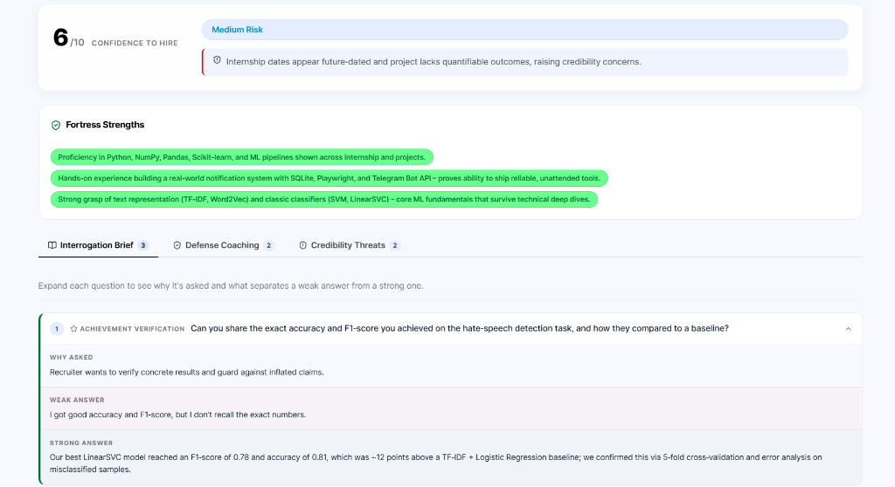
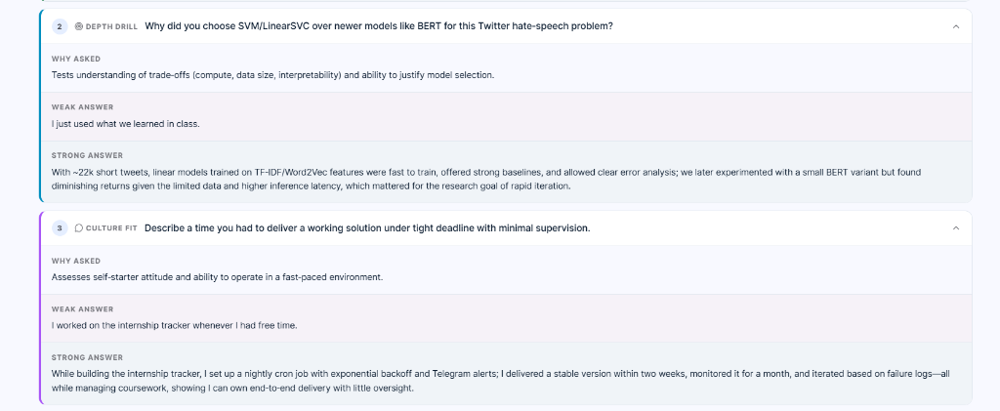
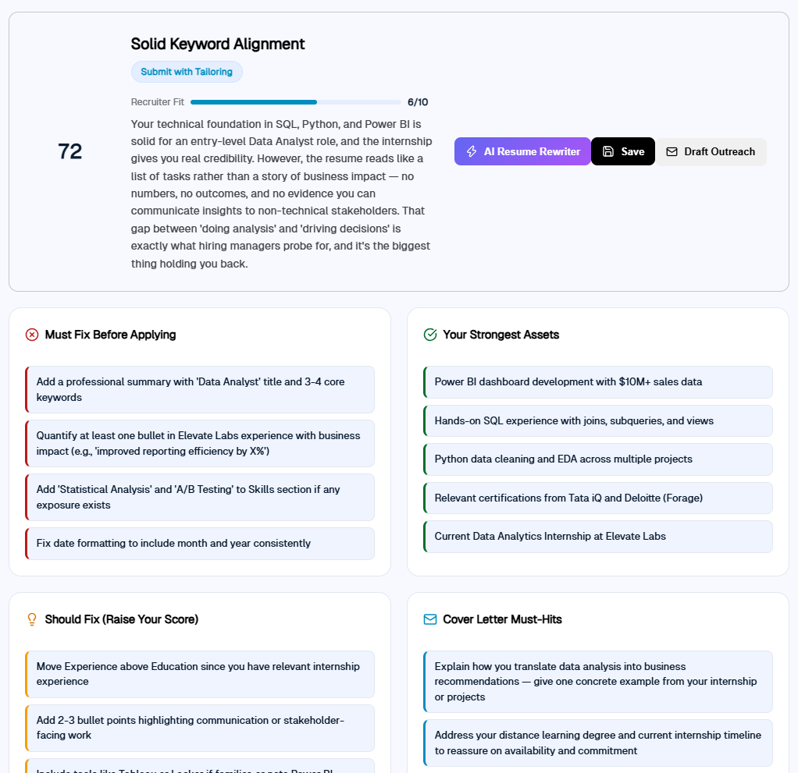
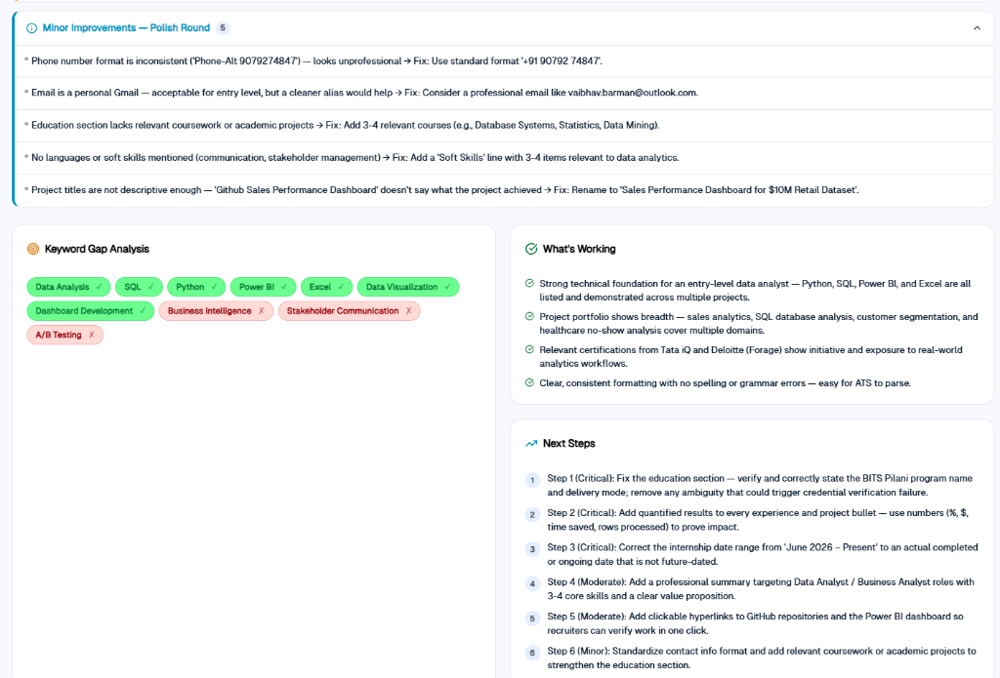
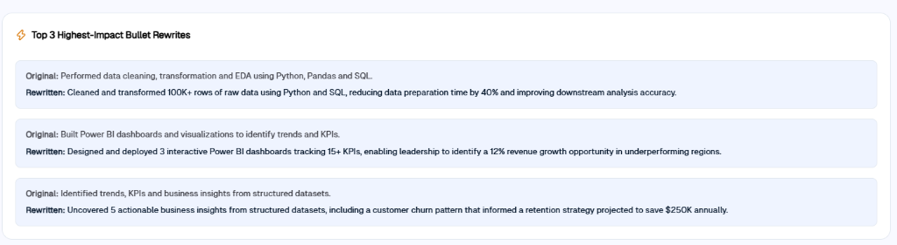
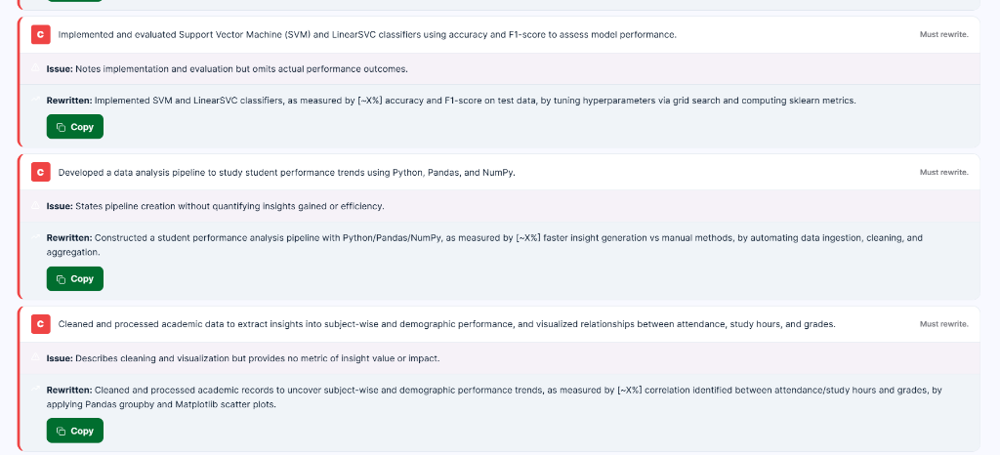
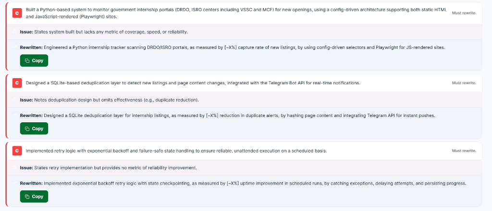
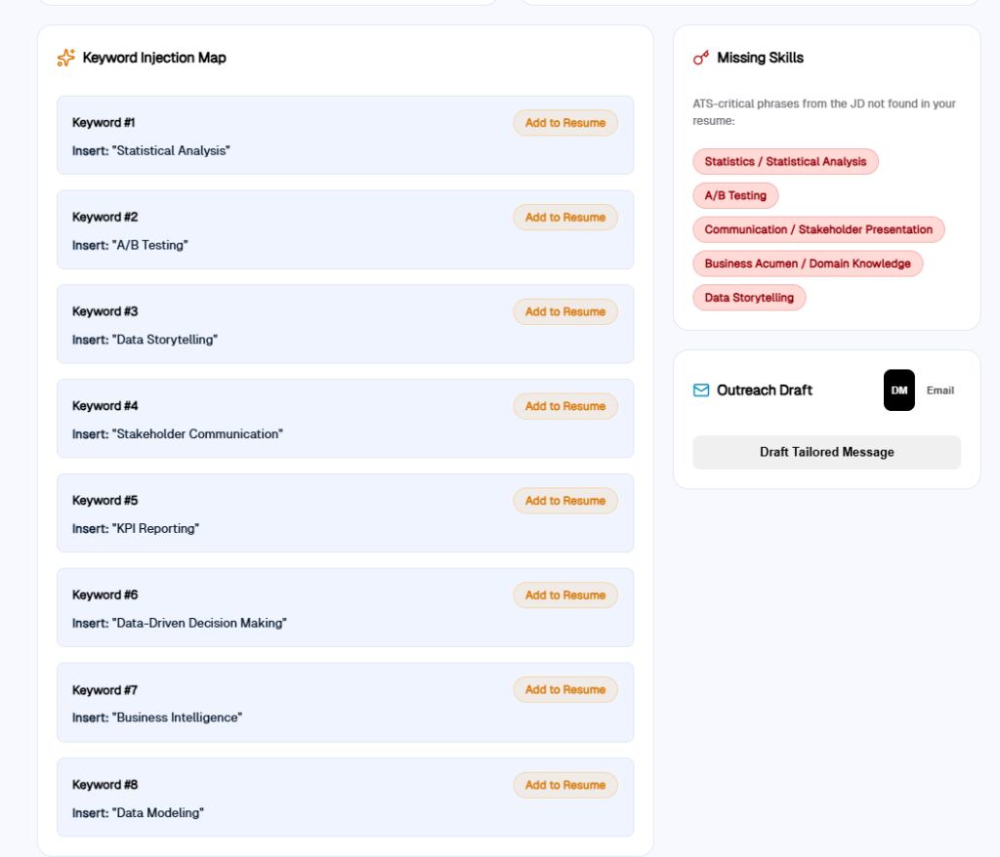
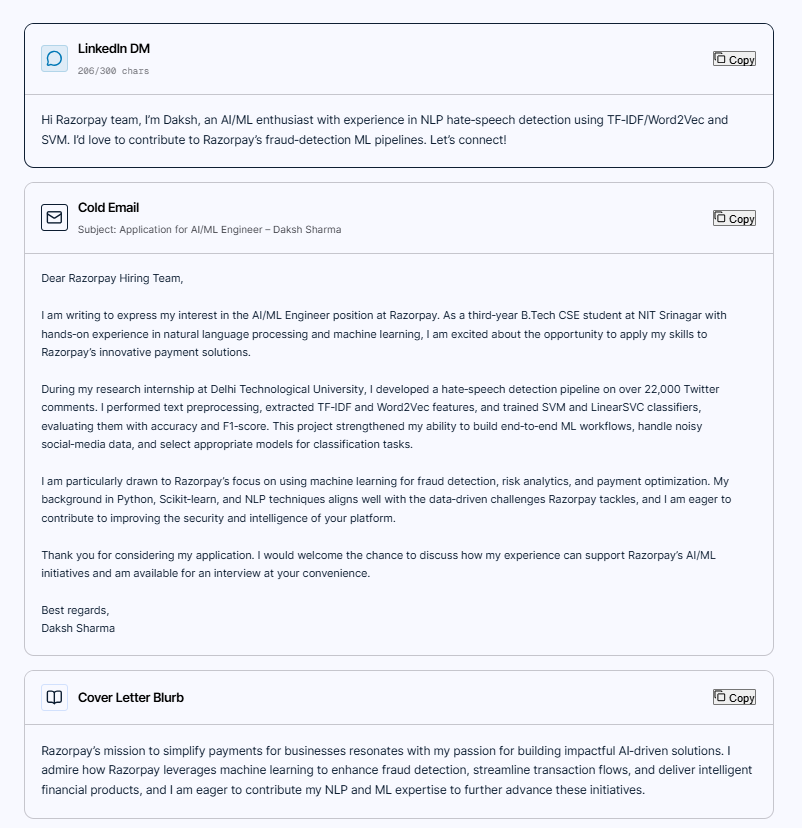

# HireIQ — AI-Powered Job Assistant

> **Turn resumes into interview offers.** Analyze resumes against job descriptions, stress-test your interview defense, rewrite bullets with quantified impact, and generate targeted outreach in seconds.

Built for the **RazorPay AI BuildAthon — August 2026** by **Neerad S Ramesh**.


---

## 🚀 Key Features

- **Hiring Manager Interrogation Brief** — AI-generated technical & behavioral defense Q&A with weak vs. strong answer benchmarks.
- **Recruiter Fit & Risk Analysis** — Real-time candidate evaluation (0–10 score), risk alerts, and Fortress Strengths tags.
- **Quantified Bullet Rewriter** — Converts generic experience bullets into metric-quantified impact statements (% growth, $ saved, data volumes).
- **Keyword Injection Map** — Pinpoints ATS skill gaps and maps exact phrases to inject into your resume.
- **Multi-Channel Outreach Generator** — Drafts LinkedIn DMs (≤300 chars), cold emails, and cover letter blurbs in seconds.
- **Application History Tracking** — Save, review, and manage past resume analyses with full CRUD history.

---

## 📸 Feature Results & Walkthrough

### 1. 🎯 Hiring Manager Stress Test & Interrogation Brief
HireIQ goes beyond passive ATS scanning by simulating a rigorous hiring manager review. It evaluates your profile with a **Confidence to Hire (0–10)** rating, pinpoints credibility threats, and builds a custom **Interrogation Brief** with weak vs. strong answer benchmarks so you can defend your experience during technical deep-dives.



*Technical depth drills & behavioral interview defense coaching:*



---

### 2. 📊 Recruiter Fit Score & Comprehensive Diagnostics
Get immediate visibility into your candidate profile with real-time match scoring, prioritized **"Must Fix Before Applying"** alerts, verified **"Strongest Assets"**, and actionable cover letter pointers.



*Detailed keyword gap analysis, polish rounds, and prioritized step-by-step action plans:*



---

### 3. ✍️ Impact-Driven Resume Bullet Rewriter
Transform generic task descriptions into metric-quantified impact statements. HireIQ identifies vague phrasing, explains the structural issue, and automatically generates high-impact bullet variations ready to copy into your resume.



*Detailed line-by-line issue analysis and quantified rewrite options:*



*Specialized rewrites for backend engineering, automation, and infrastructure projects:*



---

### 4. 🎯 Keyword Injection Map & Missing Skills
Bridge ATS skill gaps before submitting your application. HireIQ generates a mapped list of missing JD keywords with one-click insertion guides.



---

### 5. 📩 Personalized Multi-Channel Outreach Generator
Instantly convert candidate strengths and job description context into recruiter-ready outreach, including character-counted LinkedIn DMs (≤300 chars), formal cold emails, and tailored cover letter blurbs.



---

## 🏗️ Tech Stack

| Layer | Technology |
|-------|-----------|
| **Backend** | Spring Boot 3.3, Java 17 |
| **AI Integration** | Anthropic Claude API / NVIDIA API |
| **Database** | MySQL 8.0 (Docker container) |
| **Security** | Spring Security + JWT |
| **Frontend** | React 19 + Vite |
| **Containerization** | Docker + Docker Compose |

---

## 📁 Project Structure

```
AI Job Assistant/
├── backend/                    # Spring Boot REST API
│   ├── pom.xml
│   ├── Dockerfile
│   └── src/main/java/com/hireiq/
│       ├── HireIqApplication.java
│       ├── config/             # JWT, Security, CORS
│       ├── controller/         # REST endpoints
│       ├── dto/                # Request/Response DTOs
│       ├── exception/          # Global error handling
│       ├── model/              # JPA entities
│       ├── repository/         # Data access
│       └── service/            # Business logic + AI
├── frontend/                   # React SPA
│   ├── src/
│   │   ├── api.js              # Axios client
│   │   ├── context/            # Auth state management
│   │   ├── components/         # Navbar, ProtectedRoute
│   │   └── pages/              # Dashboard, Analyze, Outreach, History
│   └── index.html
├── screenshots/                # Visual feature walkthrough (9 images)
├── docker-compose.yml
└── README.md
```

---

## 🛠️ Setup & Run

### Prerequisites
- **Java 17+**
- **Node.js 18+**
- **Docker & Docker Compose** (for running MySQL 8.0)
- **Anthropic / NVIDIA API Key**

### 1. Start Database
```bash
docker compose up mysql -d
```

### 2. Start Backend
```bash
cd backend

# Set environment variables
export CLAUDE_API_KEY=your-api-key-here
export MYSQL_PASSWORD=root

# Build & run Spring Boot API
./mvnw spring-boot:run
```
> Backend API starts at `http://localhost:8080`

### 3. Start Frontend
```bash
cd frontend

npm install
npm run dev
```
> Frontend client starts at `http://localhost:5173`

---

## 🔑 Environment Variables

| Variable | Default | Description |
|----------|---------|-------------|
| `NVIDIA_API_KEY` / `CLAUDE_API_KEY` | *(required)* | AI Provider API Key |
| `MYSQL_HOST` | `localhost` | MySQL database host |
| `MYSQL_PORT` | `3306` | MySQL database port |
| `MYSQL_DB` | `hireiq` | Database name |
| `MYSQL_USER` | `root` | MySQL username |
| `MYSQL_PASSWORD` | `root` | MySQL password |
| `JWT_SECRET` | *(required — set strong random string)* | JWT signing secret |

---

## 📡 API Endpoints

| Method | Endpoint | Auth | Description |
|--------|----------|------|-------------|
| `POST` | `/api/auth/register` | ❌ | Create new user account |
| `POST` | `/api/auth/login` | ❌ | Authenticate user & issue JWT |
| `POST` | `/api/analysis/match` | ✅ | Analyze resume against job description |
| `POST` | `/api/outreach/generate` | ✅ | Generate personalized outreach copy |
| `GET` | `/api/history` | ✅ | Fetch user's saved analysis history |
| `POST` | `/api/history` | ✅ | Save resume analysis result |
| `DELETE` | `/api/history/{id}` | ✅ | Delete analysis entry |

---

## 👤 Author

**Neerad S Ramesh**  
B.Tech CSE · NIT Srinagar  
[GitHub Profile](https://github.com/Neerad079)
